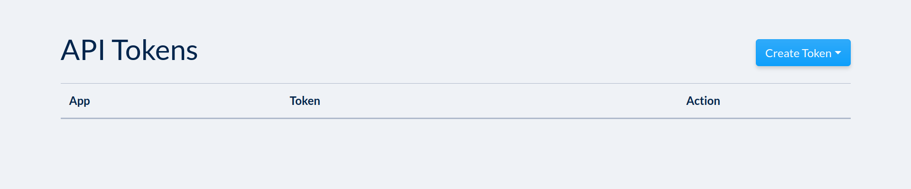
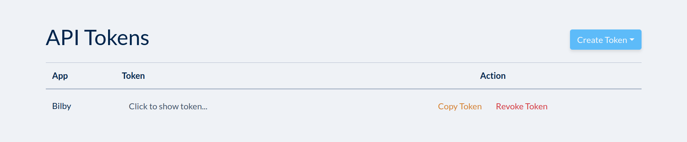

Getting started with gwcloud-python
===================================

Installation
------------

You will require Python 3.7+ to be able to use gwcloud-python. The recommended way to install gwcloud-python is with pip:

::

    pip install gwcloud-python

.. _api-token-label:

API Token
---------

In order to be able to use the gwcloud-python package, you will need an account for GWCloud and an API Token associated with that account.
You can use your GWCloud or LIGO account details on the GWCloud `login page <https://gwcloud.org.au/auth/>`_. If you don't have an existing account, `register here <https://gwcloud.org.au/auth/register/>`_.
To obtain an API Token, log into your account and then follow `this link <https://gwcloud.org.au/auth/api-token>`_.
You should be greeted with the following:

Obtaining an API Token is then as simple as clicking "Create Token" and then selecting the app, which will generate your own unique API Token:

An API token operates as your credentials, replacing your username and password when using the API, hence it is hidden by default.
The "Copy Token" button will copy the hidden token, which is a string of 64 characters, to you clipboard.
You are also able to revoke your token at any point by clicking the "Revoke Token" button, at which point the token will cease to function.
You must not share it with anybody and should revoke and recreate it if somebody else obtains it.